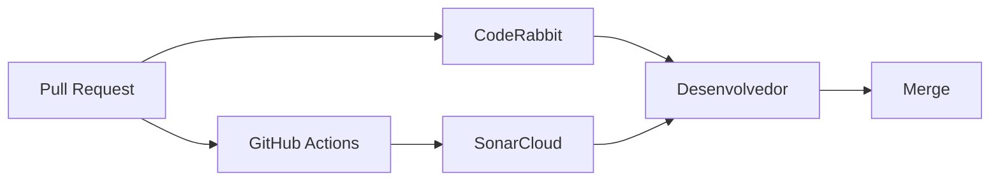

# CodeRabbit — Revisão automática de Pull Requests

Este documento descreve como integrar o [CodeRabbit](https://coderabbit.ai/) ao repositório `presencial-app`.

## Objetivo

Complementar o SonarCloud com revisão de código baseada em IA em cada Pull Request.

## Instalação

1. Acesse [https://github.com/apps/coderabbitai](https://github.com/apps/coderabbitai) e instale o GitHub App.
2. Conceda acesso ao repositório `marciacrisrs/presencial-app`.
3. Escolha **All repositories** ou apenas este repositório.

## Configuração no repositório

O arquivo `.coderabbit.yaml` na raiz já está configurado:

```yaml
language: pt-BR
reviews:
  profile: chill
  request_changes_workflow: false
  high_level_summary: true
  poem: false
  review_status: true
  auto_review:
    enabled: true
    drafts: false
chat:
  auto_reply: true
```

Para alterar o comportamento, edite `.coderabbit.yaml` e abra um PR.

### Opções úteis

| Opção | Valor | Motivo |
|-------|-------|--------|
| `language` | `pt-BR` | Comentários em português |
| `auto_review.enabled` | `true` | Revisão automática em todo PR |
| `request_changes_workflow` | `false` | Sugestões informativas, merge manual |
| `drafts` | `false` | Ignora PRs em rascunho |

## Validação

1. Abra um Pull Request de teste (ex.: branch `chore/coderabbit-test`).
2. Aguarde o bot comentar apenas nas linhas alteradas.
3. Verifique se as sugestões são acionáveis e não duplicam o SonarCloud.

## Fluxo de revisão



1. **CI** — build, testes, lint, cobertura, SonarCloud.
2. **CodeRabbit** — revisão de diff, arquitetura e legibilidade.
3. **Humano** — triagem dos comentários antes do merge.

## Critérios de aceite (#21)

| Critério | Status |
|----------|--------|
| `.coderabbit.yaml` com revisão automática habilitada | Concluído |
| Documentação e referência no README | Concluído |
| GitHub App instalado em `marciacrisrs/presencial-app` | **Pendente (manual)** |
| PR de teste com comentários do bot | Pendente após instalar o app |
| Comentários limitados ao diff do PR | Comportamento padrão do CodeRabbit |

### Ativar revisões automáticas

1. Instale o app em [github.com/apps/coderabbitai](https://github.com/apps/coderabbitai).
2. Conceda acesso ao repositório `marciacrisrs/presencial-app`.
3. Abra ou reabra um Pull Request — o bot deve comentar nas linhas alteradas em alguns minutos.
4. Feche a issue #21 após validar o primeiro review.

## Referências

- [Documentação CodeRabbit](https://docs.coderabbit.ai/)
- [SonarCloud do projeto](https://sonarcloud.io/project/overview?id=marciacrisrs_presencial-app)
